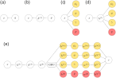

# Neural hierarchical models of ecological populations

[](https://zenodo.org/badge/latestdoi/206636551)

Preprint: https://www.biorxiv.org/content/10.1101/759944v1?rss=1

### Key idea

Parameterize a hierarchical model (an observation + process + parameter model) with a neural network, creating a **neural hierarchical model**.



Here, (a) shows linear regression, mapping input x to an output y. 
In (b) a neural network inserts hidden layers between x and y.
Analogously, an ecological model (c) maps an input x to parameters of a hierarchical model.
A neural version of model (d) would similarly involve hidden layers between x and these parameters. 
Deep models (e) can also be constructed that use more complex neural architectures, especially when data are structured in time, space, and/or over networks. 


## Hardware requirements

- 20+ GB of RAM
- 4 or more CPU cores
- GPU recommended

## Setting up the environment

This project uses [conda](https://docs.conda.io/en/latest/) to install python dependencies.

```
conda env create -f environment.yml
```

Once installed, activate the environment via:

```
conda activate neural-ecology
```

To install R dependencies:

```
R -e "devtools::install_deps(dependencies = TRUE)"
```

## Running the toy models

[](https://mybinder.org/v2/gh/mbjoseph/neuralecology/master)

This repo comes with toy models in Jupyter notebooks:

- [A neural occupancy model](binder/simple-occupancy.ipynb)
- [A neural dynamic occupancy model](binder/dynamic-occupancy.ipynb)
- [A neural N-mixture model](binder/n-mixture-model.ipynb)
- [A deep Markov model for capture-recapture data](binder/hidden-markov-model.ipynb)

## Building the paper

The workflow for building the paper is handled with GNU Make. 
To build the paper (including running the models for the case study) takes ~ 5 hours with 6 CPU cores and a GPU. 

```
make
```

